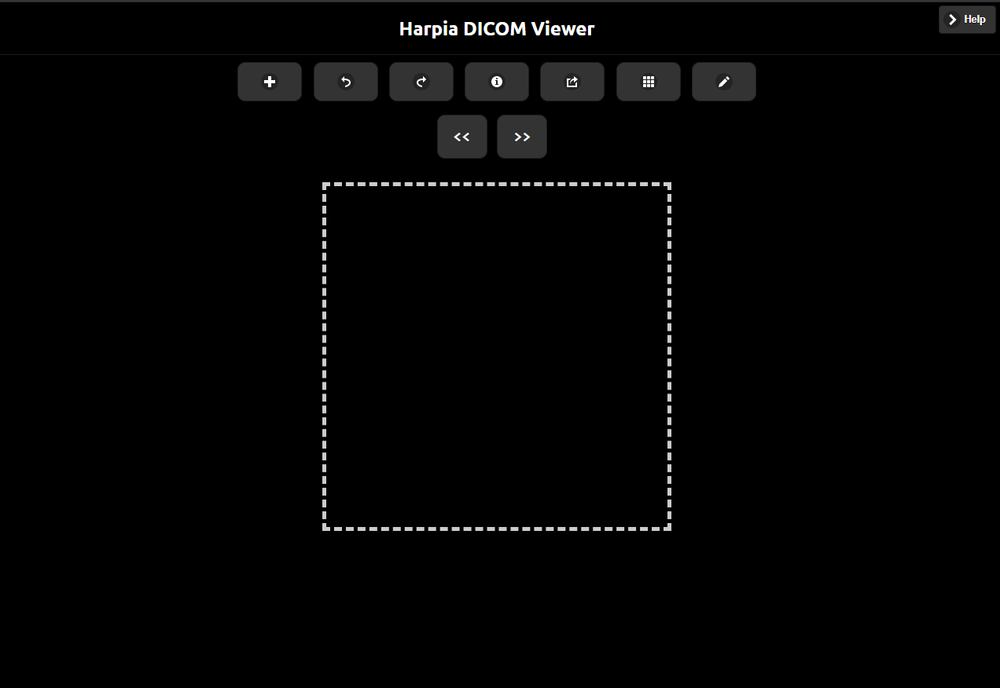

# README.md

# Harpia DICOM Viewer

Visualizador de imagens médicas fundamentado no DICOM Web Viewer (DWV) do [https://github.com/ivmartel](https://github.com/ivmartel)



### Rodar local

Instruções para rodar local

Para rodar em sua máquina, sugiro que tenha instalado:

- Node
- Visual Studio Code
- Extensão Live Server no VS Code

Se tiver isso instalado, é só baixar o projeto, abrir no VS Code e excutar o index.html no Go Live do Live Server.

### Acessar remoto

Ou pode acessar o visualizador através de:

[https://andre23arruda.github.io/dicom-viewer/stable/](https://andre23arruda.github.io/dicom-viewer/stable/)

## Carregando imagens:

Com esse visualizador é possível carregar imagens locais ou remotas.

### Imagens locais:


Selecione os arquivos de imagem que deseja carregar

Para carregar uma pasta,  é só selecionar pasta na janela acima e fazer o upload. Se estiver no chrome, haverá uma alerta perguntando se deseja fazer o upload realmente.

As anotações do json são sincronizadas através dos nomes dos arquivos json e imagem


Se carregou mais de uma imagem, será possível apertar no botão para alterar a imagem

### Imagens remotas


Para não existir problema com política de CORS, pode usar a seguinte URL no input

```html
[https://raw.githubusercontent.com/andre23arruda/dicom-viewer/gh-pages/images/pasta.png](https://raw.githubusercontent.com/andre23arruda/dicom-viewer/gh-pages/images/pasta.png)  ,  [https://raw.githubusercontent.com/andre23arruda/dicom-viewer/gh-pages/images/](https://raw.githubusercontent.com/andre23arruda/dicom-viewer/gh-pages/images/pasta.png)dicom_teste.dcm,[https://raw.githubusercontent.com/andre23arruda/dicom-viewer/gh-pages/images/](https://raw.githubusercontent.com/andre23arruda/dicom-viewer/gh-pages/images/pasta.png)pasta_annotations.json
```

Para inserir mais de um link de arquivo, separe-os com vírgula


### Imagens remotas através de URI:

Um exemplo para passar arquivos através da URI:

```html
https://andre23arruda.github.io/dicom-viewer/stable/index.html?input=https%3A%2F%2Fraw.githubusercontent.com%2Fandre23arruda%2Fdicom-viewer%2Fgh-pages%2Fimages%2F%3Ffile%3Dpasta.png%26file%3Dpasta.png%26file%3Ddicom_teste.dcm%26file%3Dpasta_annotations.json&dwvReplaceMode=void#&ui-state=dialog&ui-state=dialog&ui-state=dialog&ui-state=dialog
```

### Para passar links, eles devem estar encodados e no padrão:

Base:

```html
[https://andre23arruda.github.io/dicom-viewer/stable/index.html?input=](https://andre23arruda.github.io/dicom-viewer/stable/index.html?input=)
```

- Se for apenas um arquivo, adicionar (apenas isso):

    ```html
    https%3A%2F%2Fraw.githubusercontent.com%2Fandre23arruda%2Fdicom-viewer%2Fgh-pages%2Fimages%2Fpasta.png
    ```

- Se for mais de um arquivo (link dos arquivos contendo a tag **file** + final):

    Arquivos

    ```html
    %3Ffile%3Dpasta.png%26file%3Dpasta.png%26file%3Ddicom_teste.dcm%26file%3Dpasta_annotations.json
    ```

    Final (adicionar)

    ```html
    &dwvReplaceMode=void#&ui-state=dialog&ui-state=dialog&ui-state=dialog&ui-state=dialog
    ```

    Se tiver dificuldade em carregar vários arquivos, olha a URI do exemplo